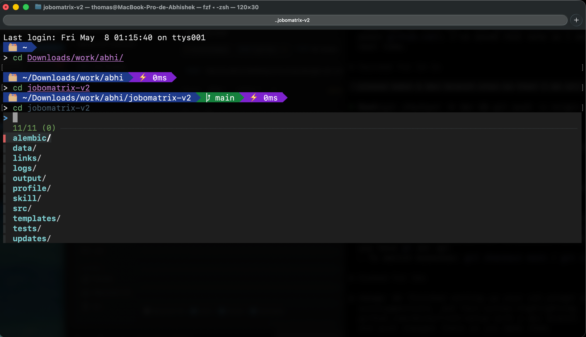

# zsh setup

Portable bundle of my zsh prompt config.



## Usage
Once installed and you've opened a new shell:

- **`cd <Tab>`** — opens a fuzzy directory menu (also works for `git checkout`, `brew install`, `kill`, and every other command)
- **`↑` / `↓`** to navigate the menu — start typing to filter
- **`Enter`** to select — **`Esc`** (or `Ctrl+C`) to cancel and go back
- **`Ctrl+R`** — fuzzy search through shell history
- **`Ctrl+T`** — fuzzy file picker (inserts the chosen path into your current command)
- **`Alt+C`** — fuzzy `cd` into a subdirectory
- **`**<Tab>`** — alternate trigger for fuzzy picker mid-command (e.g. `vim **<Tab>`)
- **`→`** (right arrow) — accept the grey ghost-text suggestion from `zsh-autosuggestions`

## Contents
- `install.sh` — bootstraps everything on a fresh macOS
- `uninstall.sh` — reverts to fresh-Mac state (removes oh-my-zsh, theme, .zshrc, fzf, font)
- `mytheme.zsh-theme` — the custom oh-my-zsh theme (powerline-style segments: 📂 path, ⎇ branch, 👾 venv, ⚡ time)
- `zshrc` — drop-in `~/.zshrc` with theme, fzf keybindings, custom plugins (fzf-tab, autosuggestions, fast-syntax-highlighting), and tab-completion settings

## Install (fresh machine)
```sh
chmod +x install.sh
./install.sh
```

The script:
1. Checks Homebrew + zsh exist
2. Installs the Meslo Nerd Font (`brew install --cask font-meslo-lg-nerd-font`)
3. Installs fzf (`brew install fzf`) — keybindings activated automatically by `~/.zshrc`
4. Installs oh-my-zsh (skipped if already present)
5. Clones custom plugins into `~/.oh-my-zsh/custom/plugins/`:
   - [fzf-tab](https://github.com/Aloxaf/fzf-tab) — fuzzy `<Tab>` completion for every command
   - [zsh-autosuggestions](https://github.com/zsh-users/zsh-autosuggestions) — ghost-text history suggestions (accept with `→`)
   - [fast-syntax-highlighting](https://github.com/zdharma-continuum/fast-syntax-highlighting) — colors commands as you type (red = invalid, green = valid, etc.)
6. Copies the theme into `~/.oh-my-zsh/custom/themes/`
7. Copies `zshrc` to `~/.zshrc` (backs up any existing one with a timestamp suffix)

After it finishes, set your terminal font to **MesloLGL Nerd Font** (or any Meslo Nerd Font variant) — that step has to be done in the terminal app's preferences and can't be scripted reliably.

## Uninstall
```sh
chmod +x uninstall.sh
./uninstall.sh
```
Asks for confirmation, then removes the theme, oh-my-zsh, `.zshrc` (+ backups), fzf, and the Meslo Nerd Font. Leaves Homebrew and zsh itself in place.
